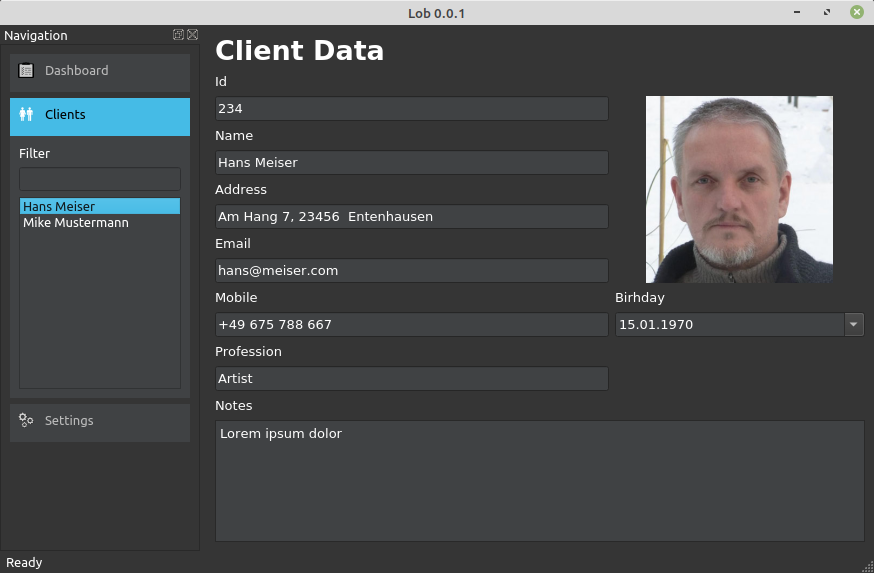
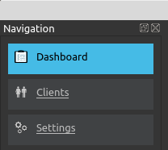

# Teil IV LOB
##Erstelle eine Line Of Business Applikation



Ein LOB ist eine Anwendung, bei der du über eine grafische Benutzeroberfläche verfügst und die Daten in einer Datenbank gespeichert sind.
In diesem Fall haben wir eine Datenbank mit Kunden und können einen neuen Kunden hinzufügen, die Liste der Kunden filtern und die Daten für einen Kunden bearbeiten.
Wir können auch ein Bild für jeden Kunden speichern.

Um die Beispiel-App auszuführen, müsst du das Modul tinydb installieren. 

```console
user@machine:/path$ pip3 install tinydb
```

Tinydb ist eine sehr kleine, aber nützliche Datenbankimplementierung, die in Python geschrieben wurde. Du  benötigst hierfür keinen Server, auf dem die Daten gespeichert werden. Und du brauchst auch keine SQL-Sprache. Tinydb speichert einfach pythonische Daten in einer einzigen Datei.

Da diese App etwas größer ist als alle anderen, die ich hier gepostet habe, drucke ich hier nicht den gesamten Quellcode. Die Quellen findst du hier: [github](https://github.com/Artanidos/PythonDesktopBook).

## Main
Wie vorher habe ich die Hauptroutine in die *main.py* im Lob-Ordner gestellt.
Dort initialisiere ich das Anwendungsobjekt und setze den Stil auf Fusion und initialisiere die Farbpalette.

```python
app = QApplication(sys.argv)
app.setStyle(QStyleFactory.create("Fusion"))
app.setStyleSheet("QPushButton:hover { color: #45bbe6 }")

p = app.palette()
p.setColor(QPalette.Window, QColor(53, 53, 53))
p.setColor(QPalette.WindowText, Qt.white)
p.setColor(QPalette.Base, QColor(64, 66, 68))
p.setColor(QPalette.AlternateBase, QColor(53, 53, 53))
p.setColor(QPalette.ToolTipBase, Qt.white)
p.setColor(QPalette.ToolTipText, Qt.black)
p.setColor(QPalette.Text, Qt.white)
p.setColor(QPalette.Button, QColor(53, 53, 53))
p.setColor(QPalette.ButtonText, Qt.white)
p.setColor(QPalette.BrightText, Qt.red)
p.setColor(QPalette.Highlight, QColor("#45bbe6"))
p.setColor(QPalette.HighlightedText, Qt.black)
p.setColor(QPalette.Disabled, QPalette.Text, Qt.darkGray)
p.setColor(QPalette.Disabled, QPalette.ButtonText, Qt.darkGray)
p.setColor(QPalette.Link, QColor("#bbb"))
app.setPalette(p)
``` 

Die Farbe kann auf zwei verschiedene Arten eingestellt werden. Du kannst die RGB-Werte ```QColor (53, 53, 53)
``` verwenden, oder du kannst eine Zeichenfolge ```QColor (" # 45bbe6 ")```
 verwenden, wie wir es in HTML tun.

Diesmal ist der Code etwas strukturierter. Die Datei *main.py* befindet sich noch im Stammordner, sodass ein Anwender sie möglicherweise sofort sieht, damit der Benutzer weiß, was er starten soll. Alle anderen Python-Dateien werden im Widgets-Ordner gespeichert.  

## MainWindow
Der visuelle Teil der Anwendung beginnt in der Klasse MainWindow, die ich in der Datei *mainwindow.py* gespeichert habe.

Bei der init-Methode machen wir einige Dinge etwas anders als in den letzten Kapiteln.

```python
def __init__(self, app):
    QMainWindow.__init__(self)
    self.app = app
    self.clients = None
        
    self.initGui()
    self.readSettings()
    self.dashboard.setExpanded(True)
    self.showDashboard()
    self.loadDatabase()
    self.loadClients()
    self.statusBar().showMessage("Ready")
``` 

Zunächst haben wir einen Parameter, mit dem wir das Anwendungsobjekt aus der Hauptroutine abrufen. Wir speichern es für später. In diesem speziellen Fall müssen Sie die Schriftart der App festlegen, nachdem der Benutzer die Anwendungseinstellungen geändert hat.

Um den Code ein wenig anzuordnen, habe ich einige Methoden erstellt, die in einer bestimmten Reihenfolge aufgerufen werden sollen. Die erste Methode heißt ```initGUI()
```, wo wir die visuellen Komponenten für dieses Fenster erstellen.

Dann haben wir die Methode ```readSettings()
```, mit der wir einige Parameter lesen, die wir beim Beenden der App gespeichert haben. Zum Beispiel haben wir die Fensterposition und die Größe gespeichert und dann bei dieser Methode nur diese Parameter wiederhergestellt.

Der Rest der Methoden ist meiner Meinung nach selbsterklärend.
Aber wir werden das später im Detail durchgehen.

##InitGui
In der initGui-Methode richten wir die Benutzeroberfläche ein.

Das erste, was wir wollen, ist eine Navigation.
Ich habe dies im Admin-Client für WordPress gesehen und es hat mir gefallen.
Wenn Sie im geöffneten Zustand auf einen Expander klicken, werden andere Expander mit einer schönen Animation (Transition) geschlossen.
Weitere Details zu diesem Steuerelement findest du weiter unten im Kapitel Expander.
 


```python
def initGui(self):
        self.dashboard = Expander("Dashboard", ":/images/dashboard_normal.png", ":/images/dashboard_hover.png", ":/images/dashboard_selected.png")
        self.content = Expander("Clients", ":/images/clients_normal.png", ":/images/clients_hover.png", ":/images/clients_selected.png")
        self.settings = Expander("Settings", ":/images/settings_normal.png", ":/images/settings_hover.png", ":/images/settings_selected.png")

        self.setWindowTitle(QCoreApplication.applicationName() + " " + QCoreApplication.applicationVersion())
        vbox = QVBoxLayout()
        vbox.addWidget(self.dashboard)
        vbox.addWidget(self.content)
        vbox.addWidget(self.settings)
        vbox.addStretch()

        content_box = QVBoxLayout()
        filter_label = QLabel("Filter")
        self.filter = QLineEdit()
        self.filter.textChanged.connect(self.filterChanged)
        self.client_list = QListWidget()
        self.client_list.setSizePolicy(QSizePolicy.Ignored, QSizePolicy.Fixed)
        self.client_list.currentItemChanged.connect(self.clientChanged)
        
        button_layout = QHBoxLayout()
        plus_button = FlatButton(":/images/plus.svg")
        self.trash_button = FlatButton(":/images/trash.svg")
        self.trash_button.enabled = False
        button_layout.addWidget(plus_button)
        button_layout.addWidget(self.trash_button)
        content_box.addWidget(filter_label)
        content_box.addWidget(self.filter)
        content_box.addWidget(self.client_list)
        content_box.addLayout(button_layout)
        self.content.addLayout(content_box)

        scroll_content = QWidget()
        scroll_content.setLayout(vbox)
        scroll = QScrollArea()
        scroll.setHorizontalScrollBarPolicy(Qt.ScrollBarAsNeeded)
        scroll.setVerticalScrollBarPolicy(Qt.ScrollBarAsNeeded)
        scroll.setWidget(scroll_content)
        scroll.setWidgetResizable(True)
        scroll.setMaximumWidth(200)
        scroll.setMinimumWidth(200)

        self.navigationdock = QDockWidget("Navigation", self)
        self.navigationdock.setAllowedAreas(Qt.LeftDockWidgetArea | Qt.RightDockWidgetArea)
        self.navigationdock.setWidget(scroll)
        self.navigationdock.setObjectName("Navigation")

        self.addDockWidget(Qt.LeftDockWidgetArea, self.navigationdock)

        self.showDock = FlatButton(":/images/menu.svg")
        self.showDock.setToolTip("Show Navigation")
        self.statusBar().addPermanentWidget(self.showDock)

        plus_button.clicked.connect(self.addClient)
        self.trash_button.clicked.connect(self.deleteClient)

        self.dashboard.expanded.connect(self.dashboardExpanded)
        self.dashboard.clicked.connect(self.showDashboard)
        self.content.expanded.connect(self.contentExpanded)
        self.content.clicked.connect(self.showClient)
        
        self.settings.expanded.connect(self.settingsExpanded)
        self.settings.clicked.connect(self.showSettings)
        
        self.showDock.clicked.connect(self.showMenu)
        self.navigationdock.visibilityChanged.connect(self.dockVisibilityChanged)

        self.client = None
        self.client_editor = None
```
Neu ist hier das ```QDockWidget```
.
Mit diesem Widget können wir oder besser unsere Benutzer das Navigationsfeld neu anordnen.
Der Benutzer kann das Navigationsfenster auf die rechte Seite des Fensters oder auf die linke Seite des Fensters ziehen.
Du kannst diese Regionen mit dem folgenden Code einschränken.
```
self.navigationdock.setAllowedAreas (Qt.LeftDockWidgetArea | Qt.RightDockWidgetArea)
```
Auch die Position des Navigationsdocks wird in den Einstellungen gespeichert.
Beim Testen dieses Verhaltens stellte ich fest, dass ich das Navigationsfenster beim Schließen nicht wiederherstellen konnte. Daher musste ich die Lob.ini-Datei löschen, die unter */home/[user]/.config/Company/Lob.ini* gespeichert war. Denke bitte daran, dass Dateien, die mit einem Punkt "." beginnen,  standardmäßig unsichtbar sind. Du musst sie also sichtbar machen, indem Sie STRG-H im Datei-Navigator drückst.

Denke also daran, das Navigationsdock erst zu schließen, wenn du einen Menüeintrag oder eine Schaltfläche erstellt hast, um es wieder sichtbar zu machen.
Um das Schließen des Widgets zu vermeiden oder besser gesagt, um es wieder sichtbar zu machen, habe ich diese Methode verwendet.

```python
	self.showDock = FlatButton(":/images/edit_normal.png", ":/images/edit_hover.png")
	self.showDock.setToolTip("Show Navigation")
	self.statusBar().addPermanentWidget(self.showDock)
	self.showDock.clicked.connect(self.showMenu)
	self.navigationdock.visibilityChanged.connect(self.dockVisibilityChanged)

    def showMenu(self):
        self.navigationdock.setVisible(True)

    def dockVisibilityChanged(self, visible):
        self.showDock.setVisible(not visible)
```
Ich habe eine Schaltfläche erstellt, die angezeigt wird, wenn das Dock unsichtbar wird.
Bevor ich vergesse zu erwähnen, warum ich ein ":" vor dem Pfad des Bildes verwende.
Dieser Doppelpunkt signalisiert Qt, dass das Bild als eingebettete Ressource gefunden wird.
Schaue dir folgende Dateien an:
*resources.qrc*  
*resources.py*  
und  
*build.sh*  

In der Datei *resources.qrc* listen wir alle Datein, die in die Resourcen eingebunden werden sollen.
```
<RCC>
    <qresource>
        <file>images/edit_hover.png</file>
        <file>images/edit_normal.png</file>
```  
Dann führen wir pyrcc5, einen mit PyQt5 gelieferten Ressourcen-Compiler, aus.

```
pyrcc5 resources.qrc -o resources.py
```

Und dieser Befehl erstellt die Datei *resources.py*.
Es enthält alle Bilder in Textform. 
```python
qt_resource_data = b"\
\x00\x00\x09\xb4\
```

Wir müssen diese Datei nur in jeder Python-Datei importieren, in der wir ein solches Bild verwenden. Daher habe ich die Ressourcen auch in zwei Hälften aufgeteilt, da wir in *main.py* nur die *logo.svg* verwenden und aus Leistungsgründen nicht alle Ressourcen überall einschließen müssen. 
```python
import resources
```

In unserem Beispiel wechseln wir zwischen dem Client-Editor, dem Dashboard und den Settings.
Um zwischen diesen Widgets zu wechseln, legen wir einfach das zentrale Widget des Fensters fest. Seien Sie jedoch vorsichtig, da diese Methode die Instanz des vorherigen Widgets zerstört. Sie müssen das Widget daher immer wieder neu erstellen.

```python
def showClient(self):
    self.client_editor = ClientEditor(self)
    self.setCentralWidget(self.client_editor)
```

Das Schließereignis des Fensters wird ausgelöst, wenn wir das Fenster schließen.  

```python
def closeEvent(self, event):
        self.writeSettings()
        event.accept()
```

Hier schreiben wir die Einstellung in eine INI-Datei. 

```python
    def writeSettings(self):
        settings = QSettings(QSettings.IniFormat, QSettings.UserScope, QCoreApplication.organizationName(), QCoreApplication.applicationName())
        settings.setValue("geometry", self.saveGeometry())
        settings.setValue("state", self.saveState())
        settings.setValue("database", self.database)
        settings.setValue("fontSize", str(self.fontSize))
```

Und beim Programmstart lesen wir diese INI-Datei und stellen die Einstellungen wieder her.  

```python
    def readSettings(self):
        settings = QSettings(QSettings.IniFormat, QSettings.UserScope, QCoreApplication.organizationName(), QCoreApplication.applicationName())
        geometry = settings.value("geometry", QByteArray())
        if geometry.isEmpty():
            availableGeometry = QApplication.desktop().availableGeometry(self)
            self.resize(availableGeometry.width() / 3, availableGeometry.height() / 2)
            self.move(int(((availableGeometry.width() - self.width()) / 2)), int((availableGeometry.height() - self.height()) / 2))
        else:
            self.restoreGeometry(geometry)
            self.restoreState(settings.value("state"))
        self.database = settings.value("database")
        if not self.database:
            self.database = "."
        fs = settings.value("fontSize")
        if not fs:
            fs = 10
        self.fontSize = int(fs)
        font = QFont("Sans Serif", self.fontSize)
        self.app.setFont(font)
```

Wenn wir einen der Expander im Navigationsdock erweitern, werden die folgenden Ereignisse ausgelöst, wie wir sie zuvor in der initGui-Methode verbunden haben.

```python
    def dashboardExpanded(self, value):
        if value:
            self.content.setExpanded(False)
            self.settings.setExpanded(False)

    def contentExpanded(self, value):
        if value:
            self.dashboard.setExpanded(False)
            self.settings.setExpanded(False)

    def settingsExpanded(self, value):
        if value:
            self.dashboard.setExpanded(False)
            self.content.setExpanded(False)
```  
Um die Animationen der Expander auszulösen, ändern wir einfach deren Expanded-Flag.
Die Animationen, bei denen ein Expander geschlossen und der andere geöffnet wird, werden nach dem Ändern des erweiterten Flags parallel ausgeführt.

Wenn der Benutzer einen Buchstaben in das Suchfeld eingibt, wird das Ereignis filterChanged ausgelöst und dort das Laden des Clients ausgeführt.  
```
    def filterChanged(self):
        self.loadClients()

    def loadClients(self):
        if not self.clients:
            return

        self.client_list.clear()
        filter = self.filter.text()
        
        a = []
        for c in self.clients:
            if filter.lower() in c["name"].lower():
                a.append(c)

        s = sorted(a, key=namesort)
        for c in s:
            item = QListWidgetItem()
            item.setText(c["name"])
            item.setData(3, c)
            self.client_list.addItem(item)
        self.client_list.setCurrentRow(0)
```  
In der loadClient-Methode gehen wir jeden Client durch und prüfen, ob der Name den Filterwert enthält. Wenn ja, fügen wir diesen Client der Liste hinzu.
Diese Methode ist nur nützlich, wenn Sie nur wenige hundert Clients haben.
Normalerweise fragen Sie einen SQL-Server nach dem Ergebnis ab, sodass nicht alle Clientdaten über das Netzwerk vom Server zum Clientcomputer transportiert werden müssen.

Zum Öffnen der Datenbank verwenden wir die loadDatabase-Methode.

```python
    def loadDatabase(self):
        try:
            self.db = TinyDB(os.path.join(self.database,"lob.json"))
            self.clients = self.db.table('Clients')
        except:
            print("Unable to open the database")
```
Hier laden wir die JSON-Datei aus dem angegebenen Pfad und initialisieren das Client-Array.  

Um einen neuen Client-Datensatz hinzuzufügen, rufen wir die Methode addclient() auf.    
```python
    def addClient(self):
        now = datetime.now()
        newclient = {
            "number": "",
            "name": "", 
            "birthday_year": 1990,
            "birthday_month": 1,
            "birthday_day": 1,
            "profession": "",
            "address": "",
            "mobile": "",
            "email": "",
            "notes": ""
        }
        self.clients.insert(newclient)
        self.showClient()
        self.loadClients()
        q = Query()
        self.client = self.clients.get(q.name=="")
        self.client["name"] = ""
        self.client_editor.reload()
```
Hier füllen wir einen Datensatz mit Daten und fügen den neuen Datensatz in die Datenbank ein. Die Daten werden sofort ohne Commit in die Datei geschrieben. Danach lesen wir die Clients erneut und suchen nach dem Client mit dem leeren Namen, auf den wir uns konzentrieren möchten.

Um einen Client aus der Datenbank zu löschen, rufen wir die Methode deleteClient() auf.  
```python
def deleteClient(self):
        self.clients.remove(doc_ids=[self.client.doc_id])
        self.loadClients()
```

Um einen Client-Datensatz zu aktualisieren, rufen wir die updateClient-Methode auf.    

```python
    def updateClient(self):
        for i in range(self.client_list.count()):
            item = self.client_list.item(i)
            c = item.data(3)
            if c.doc_id == self.client.doc_id:
                item.setData(3, self.client)
                item.setText(self.client["name"])
                break
```
Hier gehen wir alle Listenelemente durch und nachdem wir das mit der richtigen doc_id gefunden haben, ändern wir die Daten mit setData() und setText(), um die Listenansicht zu aktualisieren.

Wenn die Verwendung einen anderen Client in der Liste auswählt, wird die Methode clientChanged() aufgerufen. 

```python
    def clientChanged(self, item):
        if item:
            self.client = item.data(3)
            if self.client_editor:
                self.client_editor.reload()
            self.trash_button.enabled = True
        else:
            self.client = None
            self.client_editor.reload()
            self.trash_button.enabled = False
```

## Client Editor
Dies ist einer der drei Bildschirme, die dieser Anwendung zur Verfügung stehen.
In diesem Bildschirm gibt es einen interessanten neuen Teil, die Bildauswahl, mit der ein Bild ausgewählt wird, das der Client mit seinem Datensatz speichern soll.  
```python
        self.image = ImageSelector()
        self.image.clicked.connect(self.seek)

    def seek(self):
        fileName = ""
        dialog = QFileDialog()
        dialog.setFileMode(QFileDialog.AnyFile)
        dialog.setNameFilter("Images (*.png *.gif *.jpg);;All (*)")
        dialog.setWindowTitle("Load Image")
        dialog.setOption(QFileDialog.DontUseNativeDialog, True)
        dialog.setAcceptMode(QFileDialog.AcceptOpen)
        if dialog.exec():
            fileName = dialog.selectedFiles()[0]
        del dialog
        if not fileName:
            return

        # copy file to database dir
        name = os.path.join(str(self.win.client.doc_id) + ".png")
        path = os.path.join(self.win.database, "images", name)
        shutil.copy(fileName, path)
        self.image.setImage(QImage(path))
        self.clientChanged()
```
Wenn der Benutzer auf die Bildauswahl klickt, wird die Suchmethode aufgerufen.
Hier öffnen wir einen Dialog zum Öffnen von Dateien, damit der Benutzer ein Bild auswählen kann.
Wir setzen einen Namensfilter mit folgendem Muster:
Der Name, der in jeder Zeile der Filterliste angezeigt werden soll, hier Bilder und Alle. Und in Klammern setzen wir die Filter wie (* .png), um nur Dateien aufzulisten, die mit ".png" enden.
Nachdem der Dialog geschlossen wurde, wählen wir den ersten Dateinamen aus einer Liste.   
```python
fileName = dialog.selectedFiles()[0]
```
Wenn der Benutzer eine Datei auswählt, kopieren wir sie in den Bilderordner und ändern den Namen in doc_id (Primärschlüssel) + ".png", damit wir dieses Bild einem Client-Datensatz zuordnen können.

Jedes Mal, wenn der Benutzer die Daten in den Bearbeitungsfeldern ändert, wird die clientChanged-Methode aufgerufen.   
```python
def clientChanged(self):
        if self.loading:
            return
        self.win.client["number"] = self.number.text()
        self.win.client["name"] = self.name.text()
        self.win.client["address"] = self.address.text()
        self.win.client["email"] = self.email.text()
        self.win.client["mobile"] = self.mobile.text()
        self.win.client["profession"] = self.profession.text()
        self.win.client["notes"] = self.notes.toPlainText()
        self.win.client["birthday_year"] = self.birthday.date().year()
        self.win.client["birthday_month"] = self.birthday.date().month()
        self.win.client["birthday_day"] = self.birthday.date().day()
        self.win.clients.update(self.win.client, doc_ids=[self.win.client.doc_id])
        self.win.updateClient()
```

Hier aktualisieren wir den Client-Datensatz und senden eine Nachricht an das Fenster, damit die Liste, in der die Client-Namen angezeigt werden, aktualisiert werden kann. 

## Dashboard
Das Dashboard ist derzeit ziemlich leer und kann später verwendet werden, um einige Informationen anzuzeigen, wenn der Benutzer die Anwendung startet.
Jetzt wird nur eine Dokumentation für den Benutzer angezeigt.

Die Dokumentation wird in einem Textbrowser als HTML angezeigt. Dieser Textbrowser unterstützt Hyperlink. Wenn ein Benutzer auf den Hyperlink href = 'clients' klickt, wird die Methodennavigation ausgelöst.  

```python
self.browser.anchorClicked.connect(self.navigate)
```

Bei der Navigationsmethode senden wir zwei Signale aus, um das Hauptfenster aufzurufen.  
```python
    def navigate(self, url):
        if url.toDisplayString() == "clients":
            self.clients.emit()
        elif url.toDisplayString() == "settings":
            self.settings.emit()
```

Diese Signale werden im Hauptteil der Klasse deklariert.    
```python
class Dashboard(QWidget):
    clients = pyqtSignal()
    settings = pyqtSignal()
```
Und diese Signale werden im Hauptfenster in der showDashboard-Methode verbunden.  

```python
    def showDashboard(self):
        db = Dashboard()
        db.clients.connect(self.showClient)
        db.settings.connect(self.showSettings)
```

Jedes Mal, wenn der Benutzer auf die Hyperlink-Einstellungen klickt, wird ein Signal gesendet und daher wird die verbundene Methode showSettings aufgerufen.
Diese Terminologie heißt **Signale und Slots**.
Die Klasse mit dem Signal löst nur das Signal aus und alle anderen Objekte können sich mit diesem Signal verbinden und erhalten das Ereignis, wenn es ausgelöst wird.   

## Settings Editor
Hier ist nicht viel Besonderes. Das einzige Besondere dabei ist die Tatsache, dass wir die Schriftart der Anwendung sofort ändern, wenn der Benutzer die Schriftgröße in die fontSize Spinbox eingibt.   
```python
        self.fontSize.valueChanged.connect(self.settingsChanged)

    def settingsChanged(self):
        self.win.fontSize = self.fontSize.value()
        font = QFont("Sans Serif", self.win.fontSize)
        self.win.app.setFont(font)
```

## Controls
Nun kommen wir zu einigen benutzerdefinierten Steuerelementen (Widgets).  

### FlatButton
Der FlatButton ist nur eine QLable, die wir als Schaltfläche zum Anzeigen eines Bildes verwenden. In diesem Fall geben wir der Klasse den Dateinamen eines SVG (skalierbare Vektorgrafiken) als Argument. Dieses Bild hat eine Region mit der Sonderfarbe "#ff00ff", die durch die Hervorhebungsfarbe unserer App ersetzt wird, und der Farbe "#0000ff", die durch die Hintergrundfarbe der Schaltfläche ersetzt wird.
Mit dieser Methode können wir die Hervorhebungsfarbe der App ändern und alle Schaltflächen ändern sich automatisch.  

```python
    def createIcon(self, source, hilite_color):
        fp.write(data.replace("#ff00ff", hilite_color).replace("#0000ff", bg))
``` 

In der Methode setColors generieren wir für jeden Status der Schaltfläche ein Bild. Eine für den normalen, eine für den Hover und eine für den disabled Zustand.
Wenn wir also mit der Maus über die Schaltfläche fahren, können wir die geänderte Farbe sehen.  
```python
   def setColors(self):
        self.label_normal_color = self.palette().buttonText().color().name()
        self.label_hovered_color = self.palette().highlight().color().name()
        self.label_disabled_color = self.palette().color(QPalette.Disabled, QPalette.ButtonText).name()

        self.normal_icon = QPixmap(self.createIcon(self.svg, self.label_normal_color))
        self.hover_icon = QPixmap(self.createIcon(self.svg, self.label_hovered_color))
        self.disabled_icon = QPixmap(self.createIcon(self.svg, self.label_disabled_color))

        if self.enabled:
            self.setPixmap(self.normal_icon)
        else:
            self.setPixmap(self.disabled_icon)
```

Das bedeutet, dass wir die Pixmap nur ändern, wenn das Enter- oder Leave-Ereignis ausgelöst wird.   
```python
   def enterEvent(self, event):
        if self.enabled:
            self.setPixmap(self.hover_icon)
        QWidget.enterEvent(self, event)

    def leaveEvent(self, event):
        if self.enabled:
            self.setPixmap(self.normal_icon)
        else:
            self.setPixmap(self.disabled_icon)
        QWidget.leaveEvent(self, event)
```

Ein besonderes Verhalten von PyQt5 ist die Verwendung von Properties. Sie werden wie folgt deklariert.  
```python
    @pyqtProperty(bool)
    def enabled(self):
        return self._enabled

    @enabled.setter
    def enabled(self, enabled):
        self._enabled = enabled
        if enabled:
            self.setPixmap(self.normal_icon)
        else:
            self.setPixmap(self.disabled_icon)
        self.update()
```

Um das angeklickte Ereignis auszulösen, müssen wir ein Signal im Hauptteil der Klasse deklarieren und es auslösen, wenn der Benutzer mit der Maus klickt oder in diesem Fall, wenn der Benutzer die Maus klickt und loslässt.    

```python
class FlatButton(QLabel):
    clicked = pyqtSignal()

   def mouseReleaseEvent(self, event):
        if self.enabled:
            self.setPixmap(self.hover_icon)
            event.accept()
            self.clicked.emit()
```

### Hyperlink
Der Hyperlink ist ebenfalls von QLable abgeleitet und verwendet die Möglichkeit, HTML in einer Label anzuzeigen.
Hier überschreiben wir die Methode setText () und setzen den Text zwischen die HTML-Syntax, damit der Hyperlink in dem Label angezeigt wird.   
```python
   def setText(self, text):
        self.text = text
        super().setText("<a style=\"color: " + self.color + "; text-decoration: none; cursor: pointer;\" href=\"#/\">" + self.text + "</a>")
```
Nichts Besonderes in dieser Klasse.  

### Expander
Der Expander ist etwas kniffliger.
Hier müssen wir das Verhalten animieren, wenn der Benutzer auf den Expander klickt, um ihn zu erweitern, und wenn der Benutzer einen anderen Expander erweitert, wird dieser Expander zusammengeschoben.
Um die Animation zu erstellen, verwenden wir eine Parallelanimation, um die Farbe und die Eigenschaft MaximumHeight zu animieren.  
```python
        self.anim = QParallelAnimationGroup()
        self.height_anim = QPropertyAnimation(self.content, "maximumHeight".encode("utf-8"))
        self.color_anim = QPropertyAnimation(self, "color".encode("utf-8"))
        self.height_anim.setDuration(200)
        self.color_anim.setDuration(200)
        self.anim.addAnimation(self.height_anim)
        self.anim.addAnimation(self.color_anim)
```

Um die Farbe animieren zu können, müssen wir eine Property mit diesem Namen erstellen.    
```python
    @pyqtProperty('QColor')
    def color(self):
        return Qt.black

    @color.setter
    def color(self, color):
        pal = self.palette()
        pal.setColor(QPalette.Background, QColor(color))
        self.setPalette(pal)
```
Um verschiedene Zustände anzeigen zu können, verwenden wir diesmal PNG-Bilder. Dies ist nur eine weitere Variante, da wir SVG im FlatButton verwendet haben. Dies hängt von den Werkzeugen ab, mit denen Sie Icons erstellen.
Ich verwende Inkscape, um Icons zu erstellen. Daher ist es sinnvoll, SVG-Dateien im Allgemeinen zu verwenden. Wenn Sie jedoch nur einen pixelbasierten Editor verwenden, passt der PNG-Stil am besten zu dir. Du kennst nun also beide Methoden.  

```python
self.dashboard = Expander("Dashboard", ":/images/dashboard_normal.png", ":/images/dashboard_hover.png", ":/images/dashboard_selected.png")
        
```

## Zusammenfassung
Sie haben gesehen, wie man Benutzersteuerelemente erstellt, wie eine Datenbank zum Speichern von Daten in einer Datei verwendet wird, wie zwischen Bildschirmen navigiert wird und wie eine App erstellt wird, ohne dass ein Popup-Menü programmiert werden muss.
Heutzutage entwickeln wir viele Apps für das Tablet anstelle des Desktops und verwenden dort keine Maus mehr, sodass wir das Popup-Menü der alten Schule nicht mehr verwenden können.
